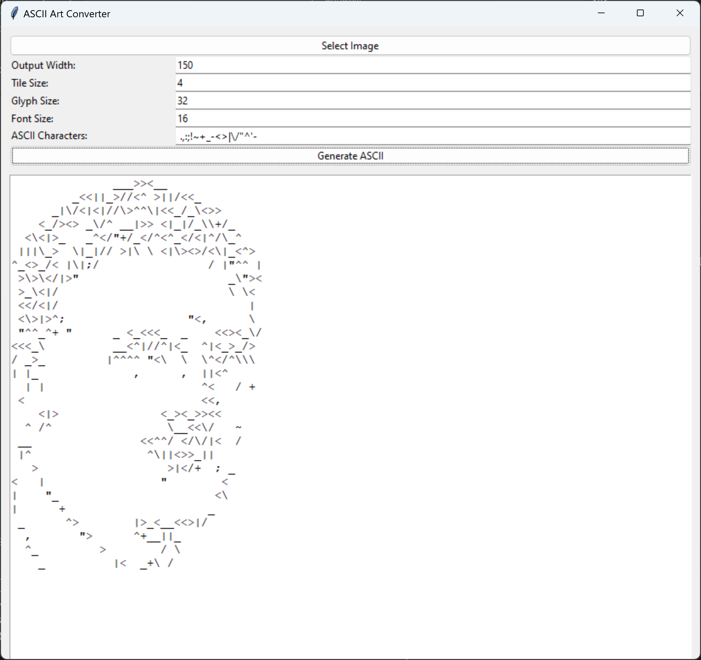

 annascii - ASCII Art Converter

annascii
========

**annascii** is a Python tool that converts images into ASCII art using an approximate nearest neighbor (ANN) search powered by [Annoy](https://github.com/spotify/annoy). It features a Tkinter-based graphical interface to control rendering settings such as output size, font size, tile and glyph size, and the character set used.

Features
--------

*   🧠 ANN-based glyph matching for high-fidelity ASCII output
*   🎨 Edge detection preprocessing using OpenCV
*   🔤 Fully customizable ASCII character set
*   🔠 Adjustable font size and glyph rendering dimensions
*   🖼️ Tkinter GUI for live configuration and output preview

Installation
------------

1.  Clone the repository:
    
        git clone https://github.com/yourusername/annascii.git
        cd annascii
        
    
2.  Install dependencies:
    
        pip install pillow annoy opencv-python
    
3.  (Optional) Make sure the font `fonts/Minecraft.ttf` exists or change the font path in the script.

Usage
-----

### Launch the GUI

    python annascii.py

### Controls

*   **Select Image**: Opens a file dialog to choose an input image
*   **Output Width**: Sets the width (in characters) of the ASCII output
*   **Tile Size**: Pixel block size used to break down the image
*   **Glyph Size**: Size of the images used to render each ASCII character for ANN matching
*   **Font Size**: The font size used when generating glyph images
*   **ASCII Characters**: The set of characters to use for rendering

Example
-------

1.  Select a grayscale or high-contrast image.
2.  Adjust settings like font size and tile size.
3.  Click **Generate ASCII**.
4.  View and copy the output from the text panel.

Output
------

The system precomputes all glyphs into an `AnnoyIndex`, compares image tiles to those glyphs using vector similarity, and assembles the final ASCII string accordingly.

Project Structure
-----------------

*   `annascii.py`: Main script containing `ASCIIArtConverter` and `ASCIIArtUI` classes
*   `fonts/`: Directory for custom fonts (like Minecraft.ttf)
*   `glyph_debug/`: Folder for visualizing generated glyphs (optional)

License
-------

MIT © Your Name